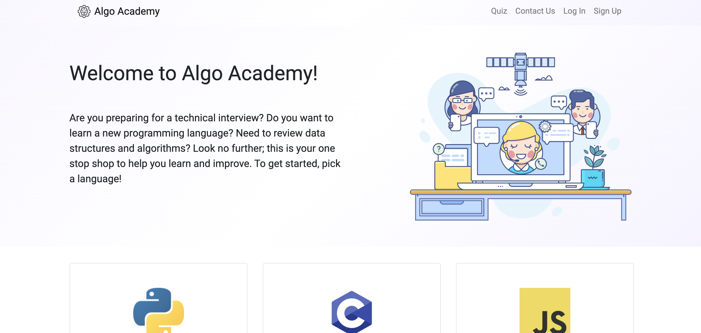
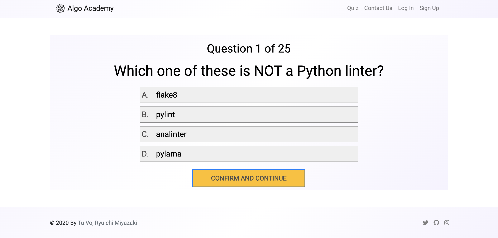
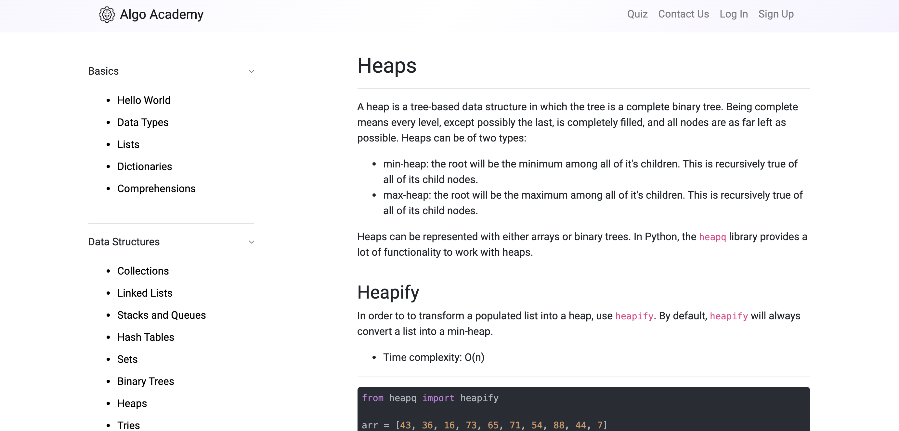
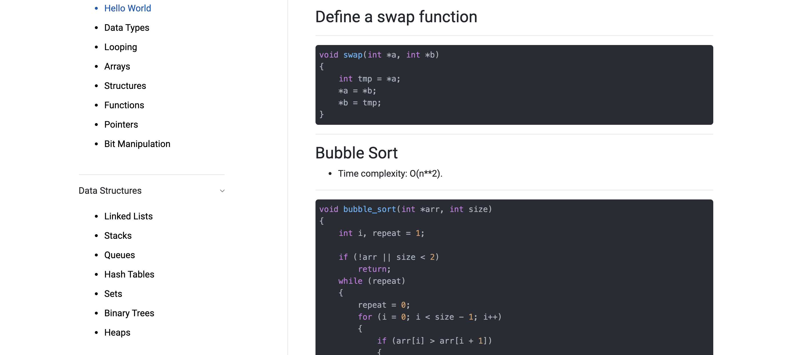
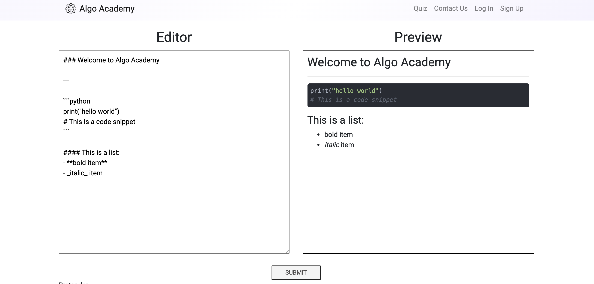
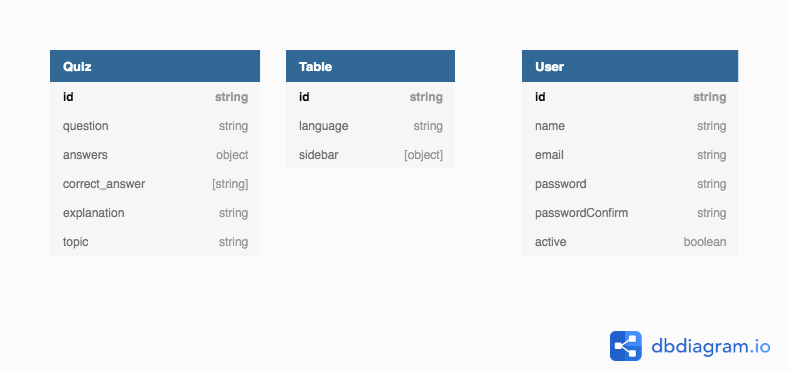

# Algo Academy

This repository contains a full-stack web application for reviewing data structures and algorithms in various programming languages. Currently, we have support for C, Python and Javascript with Go, C++, and Java on the way.

Each language has tutorials and code snippets for:

- primitive data types
- complex data types
- basic looping and builtins
- common data structures such as stacks, queues, linked lists
- advanced data structures such as priority queues, tries and graphs

There is also a quiz section in which anyone can test their knowledge in a programming topic.

This project is entirely open source and we are looking for more contributors to fill in some of the blanks!

[Algo Academy](https://algoacademy.dev) is built entirely in Javascript with React, Express, Mongo and Node as the core technologies. For more details on the tech stack, see below.

---

## Table of Contents

- [Tech Stack](#tech-stack)
- [Features](#features)
- [Views](#views)
- [Models](#models)
- [Setting up Algo Academy with Docker](#setting-up-algo-academy-with-docker)
- [Status](#status)
- [Authors](#authors)

---

## Tech Stack

- Frontend:
  - React16 - extensive use of hooks and function-based components
    - React Router DOM - dynamic routing and useful hooks such as useParam, useHistory
    - Highlight JS - library for rendering code blocks with customized styling
    - Markdown to JSX - conversion of markdown content files to JSX elements
    - React Cookie - session authentication with JWTs
    - React Bootstrap - responsiveness components and CSS classes
  - FontAwesome - icons
- Backend:
  - Express
    - Bcrypt - password encryption
    - Jsonwebtoken - user authentication
    - Swagger - API documentation
    - Morgan - logging and debugging
    - Mongo Sanitize - security middleware for SQL injections
    - Express Rate Limit - security middleware for DDOS attacks
  - Node
- Databases
  - MongoDB
    - Mongoose - Object Relational Mapping package for Mongo
- Deployment
  - Amazon Web Services EC2 (Ubuntu 18.04)
  - Amazon Web Services Elastic IP
- Continuous Development/Integration
  - Github Actions (WIP)

This is a portfolio project made by 2 computer science students who want to showcase our web development skills.

Ryuichi Miyazaki: [LinkedIn](https://www.linkedin.com/in/rmiyazaki/)

Tu Vo: [LinkedIn](https://www.linkedin.com/in/tu-vo/)

Check out our other projects at: [Akatsuki Co](https://github.com/akatsuki-co)

---

## Features

Users are able to contribute to a content page by signing up and using our contribute tab.
We are currently working on a way for users to also add questions to the quiz, so stay tuned!

---

## Views

#### Landing



#### Quiz



#### Data Structures



#### Algorithms



#### Contribute



---

## Models

Our data has 3 schemas:

- Table
- User
- Questions



---

## Setting up Algo Academy with Docker

For those that are not interested in setting up the project manually or would simply not have to worry about downloading node.js and its dependencies, I have created a Dockerfile and docker-compose.yml file to help create a container with everything you would need to run the **mern-app**.

### Install Docker

To make this as easy as possible, we will be using _Docker Compose_ to creat our container.

- If you do not have Docker yet, start by downloading it if you are on a Mac or Windows:
  https://www.docker.com/products/docker-desktop

- Or if you are on a Linux Distribution follow the directions here:
  https://docs.docker.com/compose/install/

- To confirm you have Docker Compose, open up your terminal and run the command below:

```
$ docker-compose --version
docker-compose version 1.26.2, build eefe0d31
```

- Go into the project directory to build and run the container with:

```
$ cd algoacademy/
$ docker-compose up --build
```

**This may take a few moments**

Navigate to http://localhost:5000 to view the site on the local server.

### Cleaning up the Container and Image

- To stop the container from running, use `<Ctrl-C>` twice.
- To close down the container use the command:

```
$ docker-compose down
```

- Then to clean up the container and image which we are no longer using use the command:

```
$ docker system prune -fa
```

- Confirm that the container and image is no longer there with:

```
$ docker system df -v
```

---

## Status

Version 1.0 is complete and deployed!
Check it out here: https://algoacademy.dev

To-Dos:

- Add more content to Go, Ruby and Java
- Add more content to quizzes

---

## Authors

Created by:

- [Ryuichi Miyazaki](https://github.com/rmiyazaki6499)
- [Tu Vo](https://github.com/tuvo1106)

Special thanks to contributors:

- [Tyler Zey](https://github.com/tylerzey)
- Brent Muha
